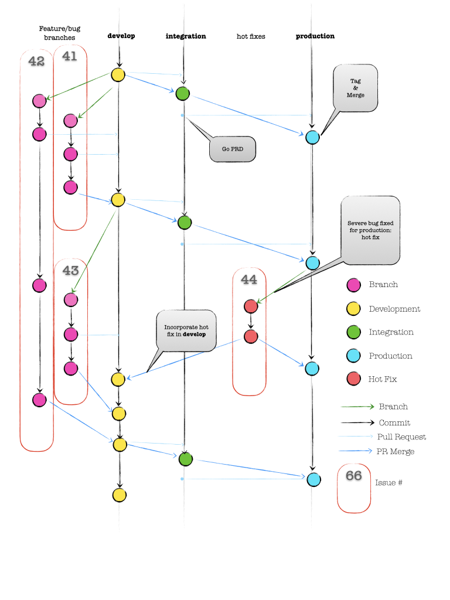
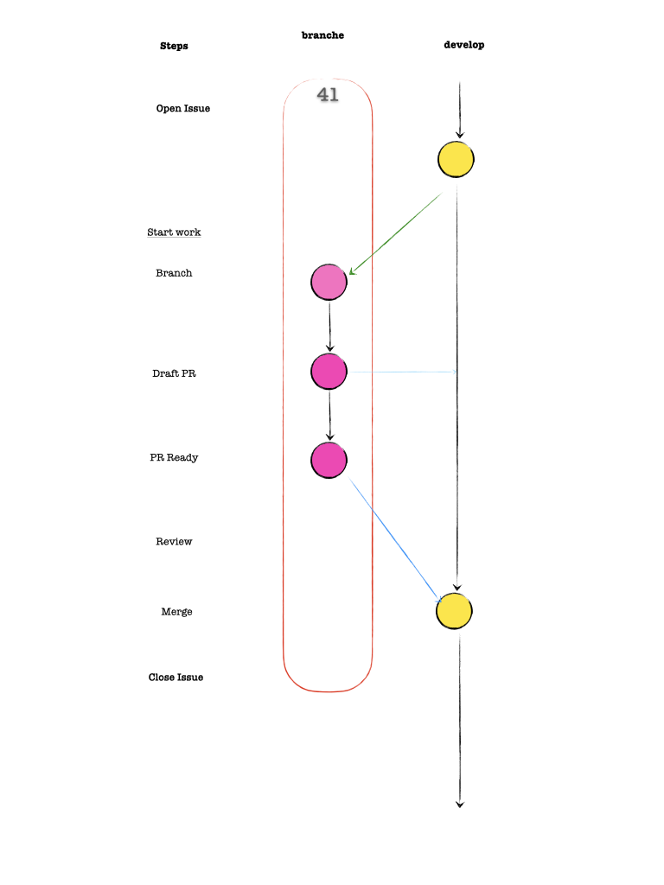

# PenCue Git Branching Model 

Based on https://nvie.com/posts/a-successful-git-branching-model/ by [Vincent Driessen](https://nvie.com/about/) 

This is derivative work and all copyrights remain owned by the original author. All mistakes and confusion are proudly owned by us. 

## Overview



## The Main branches 

At the core, the development model is greatly inspired by existing models out there. The central repo holds three main branches with an infinite lifetime:

- `DEV`  development
- `INT` Integration 
- `PRD`Production

#### DEV - Development

**DEV** is the **main** and **default** branch where the source code of `HEAD` always reflects a *latest delivered development* state.  All other persistent branches (INT & PRD) follow DEV. 

This is the only branch new changes and fixed should be merged into, with the rare expection of production *Hot Fixes*

#### INT - Integration

The **INT** branch is the integration branch.  

The **INT**  branch is used to 

- production migration testing
- test integration with other systems
- integrated / cross functional acceptance testing
- customer demo of new features
- customer integration testing. 

As stated above **INT** follows **DEV**. 

#### PRD - Production

The production Branch contains all production ready releases.  The head of the branch is the most current release available to customers.  Head minus three (3) is the oldest release potentially in use by any customer. In other words customers must be within 3 releases of the most current release. 

## Issue branches 


Next to the main branches `production` and `develop`, our development model uses a variety of supporting branches to aid parallel development between team members, ease tracking of features, prepare for production releases and to assist in quickly fixing live production problems. Unlike the main branches, these branches always have a limited life time, since they will be removed eventually.

The different types of branches we may use are:

- Feature branches
- Release branches
- Hotfix branches

Each of these branches have a specific purpose and are bound to strict rules as to which branches may be their originating branch and which branches must be their merge targets. We will walk through them in a minute.

By no means are these branches “special” from a technical perspective. The branch types are categorized by how we *use* them. They are of course plain old Git branches.

### Feature branches 



- May branch off from:

  `develop`

- Must merge back into:

  `develop`

- Branch naming convention:

  anything except `production`, `develop`, `release-*`, or `hotfix-*`

Feature branches (or sometimes called topic branches) are used to develop new features for the upcoming or a distant future release. When starting development of a feature, the target release in which this feature will be incorporated may well be unknown at that point. The essence of a feature branch is that it exists as long as the feature is in development, but will eventually be merged back into `develop` (to definitely add the new feature to the upcoming release) or discarded (in case of a disappointing experiment).

## Creating a feature branch 

A feature branch is always associated with an open github issue. 

```shell
$ gh issue create

Creating issue in PenCue/devprocess

? Choose a template Feature request
? Title gh-cli-documentation-and-screenshots
? Body <Received>
? What's next? Add metadata
? What would you like to add? Labels, Projects
? Labels documentation
? Projects DevOps Process
? What's next? Submit
https://github.com/PenCue/devprocess/issues/3

```

After the issue is opened and a number has been assigned. In this case `3`

When starting work on a new feature, branch off from the `develop` branch.

```shell
$ git checkout -b 3-gh-cli-documentation-and-screenshots develop
Switched to a new branch '3-gh-cli-documentation-and-screenshots'
```

### Create a Draft Pull Request 

As early as possible commit the feature branch back to orgin and create a pull request to track progress.   The automated integration tests are run on each update to the branch connected to the PR.  

```shell
$ git add docs/github-cli.md
$ git commit -m "Adding github cli snippets for doc"
[3-gh-cli-documentation-and-screenshots 3f14e9e] Adding github cli snippets for doc
$ git push --set-upstream origin 3-gh-cli-documentation-and-screenshots
 * [new branch]      3-gh-cli-documentation-and-screenshots -> 3-gh-cli-documentation-and-screenshots
Branch '3-gh-cli-documentation-and-screenshots' set up to track remote branch '3-gh-cli-documentation-and-screenshots' from 'origin'.
```

Continue to work on the feature with regular commits to track changes and make sure the automated integration tests are still passing. 

### Incorporating a finished feature on develop 

After the feature is finished, the draft PR is changed to a PR ready for review.  The developer requests one or more team members to review the PR. 

Finished features may be merged into the `develop` branch to definitely add them to the upcoming release:

```
$ git checkout develop
Switched to branch 'develop'
$ git merge --no-ff myfeature
Updating ea1b82a..05e9557
(Summary of changes)
$ git branch -d myfeature
Deleted branch myfeature (was 05e9557).
$ git push origin develop
```

The `--no-ff` flag causes the merge to always create a new commit object, even if the merge could be performed with a fast-forward. This avoids losing information about the historical existence of a feature branch and groups together all commits that together added the feature. Compare:


In the latter case, it is impossible to see from the Git history which of the commit objects together have implemented a feature—you would have to manually read all the log messages. Reverting a whole feature (i.e. a group of commits), is a true headache in the latter situation, whereas it is easily done if the `--no-ff` flag was used.

Yes, it will create a few more (empty) commit objects, but the gain is much bigger than the cost.

### Release branches 

- May branch off from:

  `develop`

- Must merge back into:

  `develop` and `production`

- Branch naming convention:

  `release-*`

Release branches support preparation of a new production release. They allow for last-minute dotting of i’s and crossing t’s. Furthermore, they allow for minor bug fixes and preparing meta-data for a release (version number, build dates, etc.). By doing all of this work on a release branch, the `develop` branch is cleared to receive features for the next big release.

The key moment to branch off a new release branch from `develop` is when develop (almost) reflects the desired state of the new release. At least all features that are targeted for the release-to-be-built must be merged in to `develop` at this point in time. All features targeted at future releases may not—they must wait until after the release branch is branched off.

It is exactly at the start of a release branch that the upcoming release gets assigned a version number—not any earlier. Up until that moment, the `develop` branch reflected changes for the “next release”, but it is unclear whether that “next release” will eventually become 0.3 or 1.0, until the release branch is started. That decision is made on the start of the release branch and is carried out by the project’s rules on version number bumping.

#### Creating a release branch 

Release branches are created from the `develop` branch. For example, say version 1.1.5 is the current production release and we have a big release coming up. The state of `develop` is ready for the “next release” and we have decided that this will become version 1.2 (rather than 1.1.6 or 2.0). So we branch off and give the release branch a name reflecting the new version number:

```
$ git checkout -b release-1.2 develop
Switched to a new branch "release-1.2"
$ ./bump-version.sh 1.2
Files modified successfully, version bumped to 1.2.
$ git commit -a -m "Bumped version number to 1.2"
[release-1.2 74d9424] Bumped version number to 1.2
1 files changed, 1 insertions(+), 1 deletions(-)
```

After creating a new branch and switching to it, we bump the version number. Here, `bump-version.sh` is a fictional shell script that changes some files in the working copy to reflect the new version. (This can of course be a manual change—the point being that *some* files change.) Then, the bumped version number is committed.

This new branch may exist there for a while, until the release may be rolled out definitely. During that time, bug fixes may be applied in this branch (rather than on the `develop` branch). Adding large new features here is strictly prohibited. They must be merged into `develop`, and therefore, wait for the next big release.

#### Finishing a release branch 

When the state of the release branch is ready to become a real release, some actions need to be carried out. First, the release branch is merged into `production` (since every commit on `production` is a new release *by definition*, remember). Next, that commit on `production` must be tagged for easy future reference to this historical version. Finally, the changes made on the release branch need to be merged back into `develop`, so that future releases also contain these bug fixes.

The first two steps in Git:

```
$ git checkout production
Switched to branch 'production'
$ git merge --no-ff release-1.2
Merge made by recursive.
(Summary of changes)
$ git tag -a 1.2
```

The release is now done, and tagged for future reference.

> **Edit:** You might as well want to use the `-s` or `-u <key>` flags to sign your tag cryptographically.

To keep the changes made in the release branch, we need to merge those back into `develop`, though. In Git:

```
$ git checkout develop
Switched to branch 'develop'
$ git merge --no-ff release-1.2
Merge made by recursive.
(Summary of changes)
```

This step may well lead to a merge conflict (probably even, since we have changed the version number). If so, fix it and commit.

Now we are really done and the release branch may be removed, since we don’t need it anymore:

```
$ git branch -d release-1.2
Deleted branch release-1.2 (was ff452fe).
```

### Hotfix branches 


- May branch off from:

  `production`

- Must merge back into:

  `develop` and `production`

- Branch naming convention:

  `hotfix-*`

Hotfix branches are very much like release branches in that they are also meant to prepare for a new production release, albeit unplanned. They arise from the necessity to act immediately upon an undesired state of a live production version. When a critical bug in a production version must be resolved immediately, a hotfix branch may be branched off from the corresponding tag on the production branch that marks the production version.

The essence is that work of team members (on the `develop` branch) can continue, while another person is preparing a quick production fix.

#### Creating the hotfix branch 

Hotfix branches are created from the `production` branch. For example, say version 1.2 is the current production release running live and causing troubles due to a severe bug. But changes on `develop` are yet unstable. We may then branch off a hotfix branch and start fixing the problem:

```
$ git checkout -b hotfix-1.2.1 production
Switched to a new branch "hotfix-1.2.1"
$ ./bump-version.sh 1.2.1
Files modified successfully, version bumped to 1.2.1.
$ git commit -a -m "Bumped version number to 1.2.1"
[hotfix-1.2.1 41e61bb] Bumped version number to 1.2.1
1 files changed, 1 insertions(+), 1 deletions(-)
```

Don’t forget to bump the version number after branching off!

Then, fix the bug and commit the fix in one or more separate commits.

```
$ git commit -m "Fixed severe production problem"
[hotfix-1.2.1 abbe5d6] Fixed severe production problem
5 files changed, 32 insertions(+), 17 deletions(-)
```

#### Finishing a hotfix branch 

When finished, the bugfix needs to be merged back into `production`, but also needs to be merged back into `develop`, in order to safeguard that the bugfix is included in the next release as well. This is completely similar to how release branches are finished.

First, update `production` and tag the release.

```
$ git checkout production
Switched to branch 'production'
$ git merge --no-ff hotfix-1.2.1
Merge made by recursive.
(Summary of changes)
$ git tag -a 1.2.1
```

> **Edit:** You might as well want to use the `-s` or `-u <key>` flags to sign your tag cryptographically.

Next, include the bugfix in `develop`, too:

```
$ git checkout develop
Switched to branch 'develop'
$ git merge --no-ff hotfix-1.2.1
Merge made by recursive.
(Summary of changes)
```

The one exception to the rule here is that, **when a release branch currently exists, the hotfix changes need to be merged into that release branch, instead of `develop`**. Back-merging the bugfix into the release branch will eventually result in the bugfix being merged into `develop` too, when the release branch is finished. (If work in `develop` immediately requires this bugfix and cannot wait for the release branch to be finished, you may safely merge the bugfix into `develop` now already as well.)

Finally, remove the temporary branch:

```
$ git branch -d hotfix-1.2.1
Deleted branch hotfix-1.2.1 (was abbe5d6).
```

## Summary 