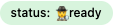
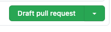

PenCue Git Branching Model 

[TOC]

## Requirements and principles

### Requirements

1. The main delivery model of PenCue Timber is as a SAAS service with a published API interface. 

   - No shipping of code.
- Each customer gets its own instance. 
      - Simplifies data ownership and integration with customer landscape. 
2. Continuous integration and deployment CI/CD of releases.  

3. Breaking API changes are very rare. 

4. Customers will stay on latest release unless there are breaking API changes in which case customer may remain on previous major release while verifying the API changes. 

   * Breaking API changes should be rare after version v1.0.0.

5. No code changes in production or integration releases. 

6. No direct commits in any of the main branches.

### Principles

1. There are 3 main branches:

   1. Development (**dev**)
   2. Integration (**int**)
   3. Production (**main**)

2. Features and fixes will only be added to the Development branch via Pull Requests (PR).

3. The Integration branch will be updated via PR from **dev** to **int**.

4. The Production branch will be updated via PR from **int** to **main**.

5. Use Semantic Versioning (https://semver.org/).

   - Major only updated on breaking API changes. We expect to be on v1 for a long time.
   - Minor for features/rework/substantial performance upgrades.
   - Patch for bugs/non functionals/minor performance fixes.

6. Fix forward.

7. These principles are flexible and adjustable after consensus by the team working.

    

## Process Overview


## The Main branches 

### Development : `dev` Branch

All new features and fixes are merged with the dev branch first via a PR.  The pull request "ready for review" triggers an automatic test suite and code review and requests code and result review by another team member. 

#### Requirements for merging

- [ ] Automatic local integration/regression testing.
- [ ] Automatic code quality (lint, PEP8 etc).
- [ ] Manual review of code and test results for completeness and correctness against issue.

The scope of the review and code is to the repo itself, integration testing and review of integrated results is done in next step.

**Note:** the impact of the feature and fix will require different ways of reviewing the merge request.  See below **TODO review guidelines for patch,rework,feature,performance,and breaking changes**

### Integration and Testing : `int` Branch

After the feature/fix has been merged into the dev branch (automatically) a Pull Request will be created to trigger the integration testing. After the requirements have been met and reviewed the code can be merged into **int**.

#### Requirements for merging

- [ ] Automatic integration testing with other branches and customer configurations. 
- [ ] Pass vulnerability scan. 
- [ ] Compare results with previous releases. 
- [ ] Pass performance benchmarks.
- [ ] Monitoring & tracing completeness. 
- [ ] Randomized extra testing (manual testcases/fuzzing/chaosmonkey/pentest/rebuild from scratch).

The scope of integration testing are all representative customer configurations using, if permitted,  (anonimized) customer production data and at an as large a scale as feasible (production and larger).

If the PR gets rejected it will be closed and process returns back to **dev** branch.  Any integration issues will be recorded as new issues.  

**Note**:  cosmetic errors (typos) can be allowed but please record them in an (existing) issue. 

### Production ready : `main` Branch

When an release is ready for main, the code is production ready.  The focus of the final PR to **main** is external: documentation ready and readable, customer updated, etc. In general the PR should rarely be rejected at this late stage. It may result in new issues for the backlog. 

#### Requirements for merging:

- [ ] Documentation ready/understandable.
- [ ] Customer updated/tickets updated. 
- [ ] Last sanity check by team outsider. 

When the PR is merged it will trigger deploy to all customer and demo environments. 

If the PR is rejected it will be closed and process returns back to **dev**.

## The Issue branches 

All development work will be done in issue branches.  The issue branches can be deleted after the code has been merged. 

Each issue branch starts with creating an issue in the repo.  

We use the following issue types:

| Issue type                                                   | Purpose                                                      | Version  increment |
| ------------------------------------------------------------ | ------------------------------------------------------------ | ------------------ |
| Fix/Bug<br />    | Fix a bug/error which doesn't affect the functionality.      | patch              |
| Patch<br />  | Code additions which don't change available functionality but are required for upcoming features. | patch              |
| Rework<br /> | Fix a bug/error which resulted in functional errors.  For example calculation errors are not as expected. These errors must be treated as special cases since it may require rework at the other side of the API. | minor              |
| Feature<br /> | Add/update a functional or technical feature. This may include changes to improve integration at the other side of the API. | minor              |
| Performance<br /> | Changes to the code which improve the performance without functional  changes.  If the functionality changes it is a feature or a breaking change. | minor              |
| Major Change<br /> | Code is a breaking change if it changes the API interface or changes in functionality which require changes to the systems using the API.  <br />Note *that extra functionality is not a breaking change as long as the API and functionality doesn't change for the current systems.* | major              |

Create a branch of **dev** when ready to work on the issue. Use the naming convention from the table below:

| Issue type  | Branch name                                                  |
| ----------- | ------------------------------------------------------------ |
| fix         | **fix**/{issue#}\_lowercase\_pr_description<br />`fix/42_api_slowdown_after_gizmo_introduction_in_32` |
| patch       | **patch**/{issue#}\_lowecase\_pr_description<br />`patch/32_adding_testing_fixtures_for_gizmo` |
| rework      | **rework**/{issue#}\_lowecase\_pr_description<br />`rework/43_gizmo_returns_dunno_instead_of_42_in_some_cases` |
| feature     | **feat**/{issue#}\_lowecase\_pr_description<br />`feat/32_adding_new_gizmo` |
| performance | **perf**/{issue#}\_lowecase\_pr_description<br />`perf/53_rewrote_complete_object_def` |
| major       | **major**/{issue#}\_lowecase\_pr_description<br />`major/56_api_change_from_rest_to_graphql` |
| hot-fix     | **hot-fix**/{issue#}\_lowecase\_pr_description<br />`hot-fix/63_graphsql_gizmo_query_breaks_gizmo_factory` |

### Version increments (bumps)

We use semver versioning for the API and internal code.   We increment according the followinr rules:

| Issue type  | Version increment | Before  | After   |
| ----------- | ----------------- | ------- | ------- |
| fix/hot-fix | vX.Y.Z+1          | v2.32.4 | v2.32.5 |
| feature     | vX.Y+1.0          | v2.32.4 | v2.33.0 |
| major       | vX+1.0.0          | v2.32.4 | v3.0.0  |

**Note:** the name of the branch is important since the start of the branch name will trigger the version increments automatically.

**Note**: the version number is set right **after** the merge into ***dev*** by an CI action.  So until the branch is merged it doesn't know its version number. (**TO DO** automatically create change log with version number after merge. This may be tricky because dev branch doesn't allow direct commits and a PR would trigger version bump).

### Release tagging

Feature branches are not tagged. All the main branches are tagged using the version number. The head of each branch has 3 tags:

| Tag    | Purpose                                                      | Changes                        |
| ------ | ------------------------------------------------------------ | ------------------------------ |
| vX.Y.Z | Unique identifier for the version.                           | No.                            |
| vX.Y   | Points to the latest patch release within a feature release.  Mainly here for completeness. The use case is limited. | At every patch within feature. |
| vX     | Points to the latest feature and patch release within a major release train. | At every patch and feature.    |

The version tags have different suffixes based on the branch: 

| Branch | Tag                    | Example          |
| ------ | ---------------------- | ---------------- |
| dev    | unstable               | v2.36.7.unstable |
| int    | rc (release candidate) | v2.36.7.rc       |
| main   | *no tag*               | v2.36.7          |

**Note** codewise there is ***no*** difference between dev, int and main.  The existence of the tag indicates the status of the release. The branches are used to trigger different test suites and deployments. 

### Issue status

| Label                                                        | Description                                                  |
| ------------------------------------------------------------ | ------------------------------------------------------------ |
|              | Issue is new but not refined or ready to work on.            |
|      | Issue is refined and ready to work on.                       |
|  | Issue is being worked on. branch created and if possible a draft PR. |
|      | Issue has been put on hold due to other priorities.          |
|          | Issue is ready for review, PR is set to ready.               |
|        | Issue won't be fixed or implemented and closed.              |
|  | Issue is a duplicate and closed.                             |
|      | Issue needs to be worked on but blocked.                     |

### Priority definitions

Priorties are used to determine the schedule of the work te done. Pick the the highest priority issues first before picking up lower priority issues.  

**Note**: work on open issues until complete even if there is an higher priority issue opened after started unless blocked and agreed on by the team.  The aim is to keep the issues flowing and limit the number of in-progress issues. 

Issues may be reassigned priorities over time: a medium priority issue may be upgraded to high if starts blocking other issues.  

| Priority                                               | Description                                                  |
| ------------------------------------------------------ | ------------------------------------------------------------ |
|            | Work on it if there is time and fits. <br />Use for small nice-to-haves. <br />Upgrade to medium it takes too long. |
|      | Normal priority.  <br />Pick an issue with the nearest milestone or else the oldest open issue. |
|          | Higher priority than medium<br />Blocks at least one medium priority issue/needs to worked on next. |
|  | Drop everything: takes priority over all other activities. <br />Only priority level to pre-empt other issues. |

### Working on an issue & Pull Requests

An issue represents a complete unit of work: feature, bug, performance improvement etc.  

***An issue should be sized to be completed in a single sprint.***  

But we don't want 1 massive merge at the end of the sprint so the issue needs to be split up in smaller chunks: 1 or 2 days of work. We use Pull Requests as the way to split up an issue in manageable chuncks.  During refinement of the issue we make a sketch of the expected PRs. 

## Development workflow 

### Open an issue 

Open an issue in the **repository** most relevant to the issue; ie in which you expect the bulk of the work to be done.  

Issues should be opened as soon as the issue is raised.  This may be some time before work on it commences.  

The issues can be opened on the command line or via the browser the https://github.com/org/repo/issues/.

| Field       | Description                                                  | Example                                                      |
| ----------- | ------------------------------------------------------------ | ------------------------------------------------------------ |
| **Title**   | A short descriptive title for the issue starting with *feat*/*fix*/*rework* etc. It should give your team member an idea what the issue is about. | `feat/add-gizmo-factory`                                     |
| **Body**    | Use the feature or bug template as a guide. Leave the headers and clean up the boilerplate text. |                                                              |
| **Labels**  | *Type*: label with feature/fix etc/ <br />*Status*: status of the issue (see above)<br />Priority: priority of issue (see above) |  |
| **Project** | Assign the issue to the project board for the repo.          | Timber                                                       |
| Milestone   | If known assign the milestone the issue should be completed by. | *sprint 6 - are we having fun yet? :tm:*                     |

:high_brightness: Use [github cli](https://cli.github.com/) to create issues and PR from the command line: `gh issue create` and `gh pr create`

Note the number of the issue after creation. We assume **3** for the following examples


### Create feature branch

When starting work on a new feature, branch off from the `dev` branch.

```shell
$ git checkout -b feat/3-gh-cli-documentation-and-screenshots dev
Switched to a new branch 'feat/3-gh-cli-documentation-and-screenshots'
```

###### As early as possible commit the feature branch back to orgin and create a pull request to track progress.   

The automated tests are run on each commit to the branch connected to the PR.  

First commit: 

```shell
$ git add docs/github-cli.md
$ git commit -m "Adding github cli snippets for doc"
[feat/3-gh-cli-documentation-and-screenshots 3f14e9e] Adding github cli snippets for doc
$ git push --set-upstream origin feat/3-gh-cli-documentation-and-screenshots
 * [new branch]      feat/3-gh-cli-documentation-and-screenshots -> feat/3-gh-cli-documentation-and-screenshots
Branch 'feat/3-gh-cli-documentation-and-screenshots' set up to track remote branch 'feat/3-gh-cli-documentation-and-screenshots' from 'origin'.
```

### Create a Draft Pull Request 

Either create a pull request from the github web interface or command line. 

| Field         | Description                                                  | Example                                                      |
| ------------- | ------------------------------------------------------------ | ------------------------------------------------------------ |
| **Title**     | A short descriptive title for the pull request <br />starting with *feat*/*fix*/*rework*  etc<br /><br />tip use the same name as the branch name <br />It should give your team members a good idea what the PR will archieve. <br /> | `feat/3-gh-cli-documentation-and-screenshots`                |
| **Body**      | Use the feature or bug template as a guide.  <br />leave the headers and clean up the boilerplate text. <br /><br />link to the issue by using the [magic words](https://docs.github.com/en/free-pro-team@latest/github/managing-your-work-on-github/linking-a-pull-request-to-an-issue) `resolves #3`<br />you can link to an issue in another repos by using the full name <br />followed by the issue number <br />`resolves PenCue/devprocess#3` |                                                              |
| **Reviewers** | Select 1 or 2 team members to review the PR when ready.   <br />Ask the reviewers as early as possible in the process so they are aware and can follow the progress. |                                                              |
| **Assignees** | Assign the PR to team member working on it (probably yourself) |                                                              |
| **Labels**    | Copy labels of the issue. <br />(we will automate this when it becomes tedious) | <br /> |
| **Project**   | Assign the issue to the project board of the issue (yes we will automate) | Timber                                                       |
| Milestone     | Assign the same milestone as the issue (yes, we will automate) | *sprint 6 - are we having fun yet? :tm:*                     |
| linked issues | Link to issue if not linked in the body text.                |                                                              |

**note** Don't forget to use the "draft pull request" button

. 

**note** you can change it to draft via the web interface later on.

 

##### Creating PRs using the command line 

full cli version 

```shell
$ gh pr create --draft

Creating draft pull request for feat/3-gh-cli-documentation-and-screenshots into dev in PenCue/devprocess

? Title feat/3-gh-cli-documentation-and-screenshots
? Body <Received>
? What's next?  [Use arrows to move, type to filter]
> Submit
  Continue in browser
  Add metadata
  Cancel

```

open create a pull request in the browser: 

```shell
$ gh pr create --web
Opening github.com/PenCue/devprocess/compare/dev...1-document-git-branching-approach in your browser.
```

### Commit regularly

Try to commit regularly at logical points in the development so the reviewers are aware of the progress. 

### Mark *Ready for review*

Once the feature/fix etc is ready for review mark the PR *Ready for review*. 

In the web interface:


Via the command line

```shell
$ gh pr ready
✔ Pull request #2 is marked as "ready for review"
```

### Review

#### Reviewee POV

It is not personal!

- Be available for questions from the reviewers.
- Take a step back while the reviewers do their thing. 
- Anything you came across you want to refactor/fix?
- Create issues and use the priority to indicate how urgent you think it is. 
- Does the architecture/best practices still fit the new design?
- Raise with team.

#### Reviewer POV

The responsibility of the reviewer is provide a second / third pair of eyes and mind on the code. By approving the code the reviewer shares responsibility for the developed feature/fix.  

Please take the time to review changes. Use as much time as you need but as guideline we expect the review effort to be proportional to the impact of the code/change.  So rubberstamping a minor or major change is not ok. 

##### Review guidelines

- [ ] Review the functionality/fix
  - [ ] Is it complete? 
  - [ ] Was it overcomplete? 
    - [ ] Is the extra functionality documented and communicated?
- [ ] Review the test cases. 
  - [ ] Do you understand what is tested? Would you do it the same way?
  - [ ] Consider negative test cases. Are there the cases to check for error conditions (unhappy path testing)?
  - [ ] Consider edge cases. Look at the code and check if there are boundry conditions/conditionals. Are there test cases for all paths?
  - [ ] Run the test suite, modify test cases and see if you can break stuff.
- [ ] Review the code
  - [ ] Read the code. Do you understand what it is doing? Is there any magic? 
    - [ ] Do you think it is understandable in 3 months? 1 year?
  - [ ] Is the naming of classes/objects/parameters/variables consistent with the rest of the code base?
  - [ ] Is the behaviour of methods/functions consistent?  Are errors handled consistently? 
  - [ ] How is the documentation?  Are all parameters, returns and sideeffects clearly documented. 
- [ ] Review the design
  - [ ] Is the design line with the architecture / agreed best practices  
  - [ ] Is the architecture well defined for this case? 
  - [ ] Are there architectural changes/decisions made?
    - [ ] Have they been recorded in a architectural decision record (_adr)?
    - [ ] Is there consensus by the team?
- [ ] Review nonfunctionals
  - [ ] Performance impact?
    - [ ] Guestimate of more/less.
  - [ ] Cost impact? 
    - [ ] More or less? 
  - [ ] Do the changes warrant a security review?
    - [ ] Any new interfaces added? 

These are only guidelines. Use your expertise and experience to focus your effort.  

Note: 

- It is ok to comment or request changes.  
  - Make it helpful and respectful.
  - Be clear and concise
  - Explain why and if possible where and how. 
  - Feel free to offer an solution/assistance. 
- Don't approve the changes if you didn't have time to review
- Don't approve the changes if you don't understand changes. 

### Approval 

At least one reviewer needs to approve the PR before it can get merged into the main branch.  If there are commits after the approval the PR needs to be reviewed again. 

### Merge and delete

After the approval the PR can be merged and the feature branch deleted. 


## References 


Based on https://nvie.com/posts/a-successful-git-branching-model/ by [Vincent Driessen](https://nvie.com/about/) 

This is derivative work and all copyrights remain owned by the original author. All mistakes and confusion are proudly owned by us. 